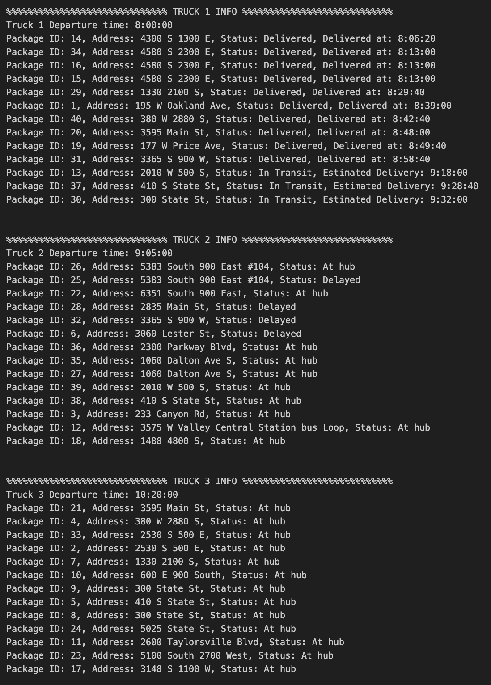
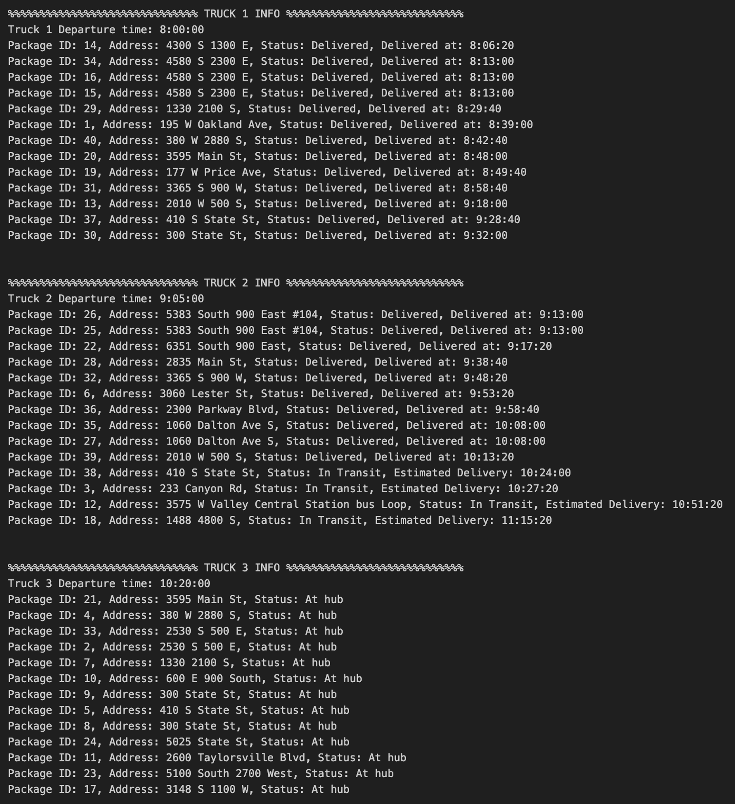
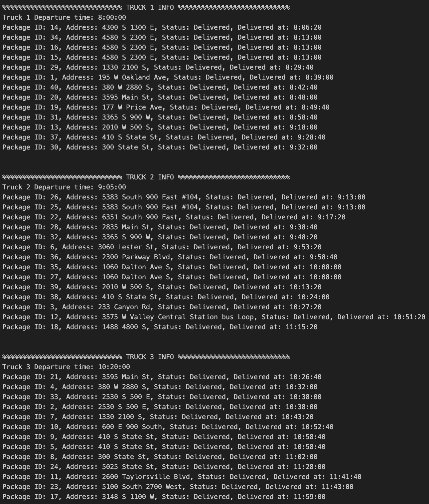
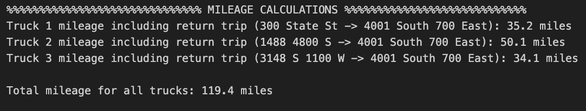

## Ben Robbins SID: 011007860
# C950 - Data Structures and Algorithms 2: Task 2

## D1: All packages at 9:04am

## D2: All packages at 10:19am

## D3: All packages at 1:00pm

## E: Display the total mileage for each truck, combined total mileage must not exceed 140 miles
#### Note: The total mileage includes the each truck's return trip to the hub.

## F1: Strengths of TSP/Nearest Neighbor Algorithm and self-adjusting hash map
- **Simplicity**: The Nearest Neighbor algorithm is straightforward to implement and understand, making it accessible for quick route planning. Simply assigning packages to the truck with a straightforward add_packages() method allows route to be recalculated and an optimized route derived. This provides a highly modular approach that can easily accommodate increased package volume. Greedy heuristics like Nearest Neighbor are often used in practice for their speed and ease of implementation, especially when exact solutions are not feasible or are computationally expensive.
- **Efficiency**: The Nearest Neighbor algorithm is computationally efficient, making it suitable for real-time applications. It can quickly generate a route based on the nearest unvisited package, which is particularly useful in scenarios with time constraints.
- **Scalability**: A chained hash map allows for quick lookup of packages and the ability to store a minimal identifier such as an id to be able access a larger code object with many complex and dynamic attributes. This makes the business logic much easier to manage and can scale well with an increased number of packages. The objects themselves are also expandable, allowing for complex requirements and special handling instructions to be added as needed.

## F2: Program meets all requirements
- **Delayed Packages**: Packages 6, 25, 28, 32 are delayed on the plane. Prior to 9:05am the packages must show special status "Delayed". Once loaded on truck 2, they must transition to "In Transit".
- **Wrong Address**: Package 9 has been assigned the wrong address which WGUPS is aware of this but still doesn't know the correct address until 10:20am. Prior to 10:20am the package must reflect originally address "300 State St" and after 10:20am it must reflect the correct address "410 S State St". The package must be delivered to the correct address. See the package information at the 9:04am and 10:19am screenshots above.
## F3: Identify alternative algorithms
- **Dijkstra's Shortest Path**: This is also a greedy heuristic algorithm but instead of navigating to nearest neighbor, it calculates the shortest path from the start node to all other nodes in the path. It uses a weighted graph that has the ability to negotiate critical areas of the path that may not be the nearest neighbor but is the most efficient route. This is particularly useful in scenarios where the cost of travel varies significantly between different paths. This is an algorithm that will certainly meet the requirements of WGUPS as it is guaranteed to find the shortest path and deliver the most optimized route. It has an identical approach to Nearest Neighbor as far as package distribution and would be able to handle the package complications posed in the problem. (geeksforgeeks.org, 2025)
- This algorithm differs from Nearest Neighbor in that considers the entire graph by using weighted edges between nodes to determine the most efficient path. Nearest Neighbor simply considers distance. 
- **A* Search Algorithm**: A* (A-Star) is a graph navigation and pathfinding algorithm that combines features of both Dijkstras shortest path as well as Greedy Best-First search. It uses an equation to calculate the cost of the path for every step in the path traversal. The equation $f(n) = g(n) + h(n)$, where $g(n)$ is the movement cost from the start to the next node and $h(n)$ an estimated cost using heuristics from that node to the end of path. This provides a step-by-step basis as well as a planned route to the end of the continually updated as the path is traversed. This is a powerful and "intelligent" algorithm that can adapt to package complications and suit a package delivery service like WGUPS. (geeksforgeeks.org, 2024)
- A* search uses heuristics like Dijkstra's but also uses an informed path strategy that allows some foresight in the path traversal. This is a more advanced strategy than nearest neighbor, which does not consider any cost or analysis of the entire path, it is only concerned with the next step.

## G: Would you have a different approach?
- An approach i would've liked to have is a flag or some piece of data which allowed for special cases to be handled a different way. The manual process of delaying packages due to delays and inaccurate information is not a programmatic solution. If the package could be flagged automatically and then dispersed to a "last chance" truck that can handle the edge cases, a more complex graph algorithm like A* could be used easier, as it considers various costs and factors.

## H1: Alternative data structures
- **Hash map**: The hash map correctly reads in the required package information from the CSV file generated from the WGUPS requirements. It allows for quick access and expandability with bucket chaining to handle collisions. 
- **Dictionary**: A dictionary could have been used to the effect of {"key":[data]}, where the key is the unique package id and the data is an array of various data strings, integers, or object attributes that represent the package information.
- **Database**: A lightweight application database like SQLite or PostgreSQL could have been used to store all of the packages. This is becoming much more common for smaller applications now that containerization is so prevalant in development. This would allow for complex queries and data manipulation, but may be overkill for the requirements of WGUPS.

## I: Sources
- GeeksforGeeks. *“A* Search Algorithm.”* GeeksforGeeks, 30 July 2024. https://www.geeksforgeeks.org/a-search-algorithm/
- GeeksforGeeks. *“What is Dijkstra's Algorithm? Introduction to Dijkstra's Shortest Path Algorithm.”* GeeksforGeeks, 9 Apr. 2025. https://www.geeksforgeeks.org/introduction-to-dijkstras-shortest-path-algorithm/